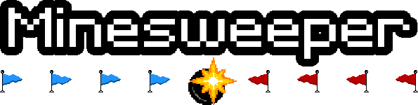

   

**Minesweeper** is a remake of the classic game of the same name for Microsoft Windows with an additional feature allowing for a turn-based **online** multi-player mode between two players (using the TCP protocol)

## Download
[Minesweeper x86_64 executable zip file](https://github.com/Muller-Castro/Minesweeper/releases)

## Credits
- Muller Castro — **Project Management**, **Design**, **Programming**, **Art** and **Soundtrack**
- Matheus Aguilera — **Art** and **Soundtrack**

## Development Environment
- C++17
- GCC 7.3.0 MinGW (SEH) - 64-bit
- Code::Blocks 20.03

### Libraries
- [SFML](https://www.sfml-dev.org/index.php)
- [pngcrush](https://pmt.sourceforge.io/pngcrush)
- [tweeny](https://github.com/mobius3/tweeny)
- [Encryptions](https://github.com/calccrypto/Encryptions)
- [json11](https://github.com/dropbox/json11)

## Notes
- You need to generate an AES-128 key and set it in *"project/include/tools/EncryptionKey.h"* in order to encrypt the file that stores the player's record. [You can use this service to do that.](https://asecuritysite.com/encryption/keygen)
- The **Debug** build target should run only through Code::Blocks, while the **Release** target should run directly by the executable inside of the *bin* folder. The **StaticRelease** can do both.
- If you're having problems connecting with the other peer then you just need to forward the proper ports and make sure you're using the public IP address. Also try to allow TCP permissions on your firewall.
